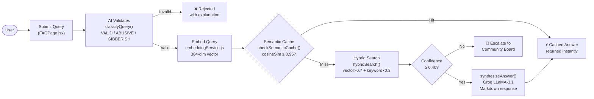
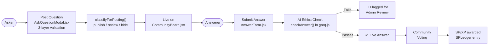
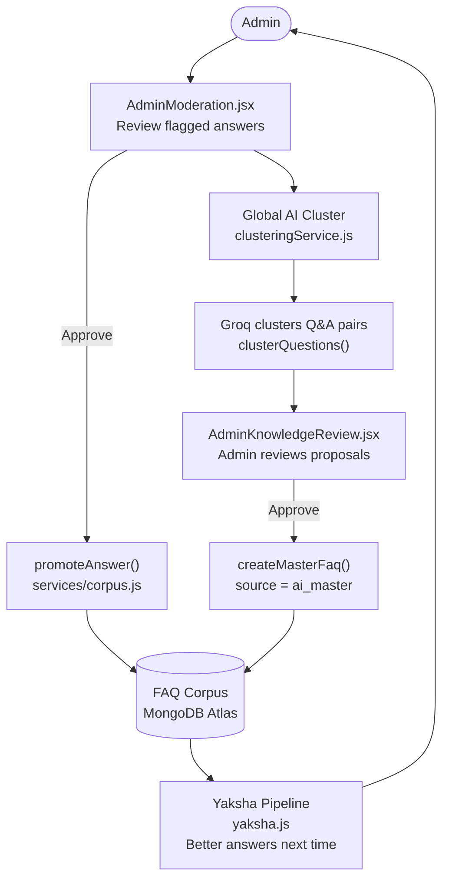

# Samagama FAQ System — Product Requirements Document (PRD)

> **Repository:** `vicharanashala/cs10` (local: `FAQ_IITRPR/GitHub/`)  
> **Institution:** Vicharanashala, IIT Ropar  
> **Last Updated:** June 2026

---

## 1. Executive Overview

Samagama is a comprehensive, AI-enhanced FAQ and Community Q&A platform tailored for college and internship programs (e.g., Vicharanashala Internship Program / VINS / VISE at IIT Ropar). It bridges the gap between static knowledge bases and dynamic community support by offering an AI assistant (**Yaksha**) that answers user queries using a vector-embedded FAQ corpus.

If the AI cannot confidently answer a query (confidence < 40%), it seamlessly escalates the question to a community board where peer users (Answerers) can respond. An administrative moderation layer ensures content quality, leverages AI to cluster recurring community questions, and synthesizes them into **Master FAQs** to continuously enrich the knowledge base — creating a self-reinforcing knowledge loop.

---

## 2. Project Goals & Purpose

| Goal | Description |
|---|---|
| **Instant Support** | Provide fast, accurate, context-aware answers to participant queries using AI (24/7 self-service) |
| **Community Engagement** | Foster peer-to-peer assistance when the AI cannot resolve complex or edge-case questions |
| **Knowledge Evolution** | Automatically identify recurring community questions and synthesize them into permanent FAQ entries |
| **Gamification & Quality Control** | Award Samagama Points (SP) / XP to contributors; provide admins with robust moderation tools |

---

## 3. Target Users

| Role | Description |
|---|---|
| **Askers** (Students/Participants) | Search the FAQ, interact with the Yaksha AI assistant, post questions to the community if unresolved |
| **Answerers** (Peers/Mentors) | Browse open community questions, provide answers, earn SP/XP for approved and promoted contributions |
| **Administrators** (Moderators) | Monitor analytics, moderate flagged content, approve AI-synthesized Master FAQs, manage the FAQ corpus, and adjust user SP balances |

---

## 4. Key User Journeys

### 4.1 AI Query Flow



### 4.2 Community Q&A Flow



### 4.3 Moderation & Knowledge Evolution Loop



---

## 5. Technical Architecture & Dependencies

### 5.1 Repository Structure

```
GitHub/                         ← Repository root
├── backend/                    # Node.js + Express REST API
│   ├── config/                 # DB connection & config
│   ├── controllers/            # 8 HTTP handler files
│   ├── middleware/             # auth.js · errorHandler.js
│   ├── models/                 # 9 Mongoose schemas
│   ├── routes/                 # 8 route files
│   ├── scripts/                # Seed & utility scripts
│   ├── services/               # 12 business logic files
│   ├── utils/                  # Shared helpers
│   └── server.js
├── client/                     # Public React app (Vite)
│   └── src/
│       ├── api/                # Axios API clients
│       ├── components/         # 9 reusable UI components
│       ├── context/            # React context providers
│       ├── hooks/              # Custom React hooks
│       ├── pages/              # 10 page components
│       └── services/           # Frontend service helpers
└── admin/                      # Admin React app (Vite)
    └── src/
        ├── components/         # Admin UI components
        ├── pages/              # 9 admin-specific pages
        └── services/           # Admin API service layer
```

### 5.2 Tech Stack

| Layer | Technology | Version |
|---|---|---|
| **Frontend (Client)** | React + Vite | React 19, Vite 8 |
| **Frontend (Admin)** | React + Vite + Tailwind CSS v4 | React 19, Vite 8 |
| **Routing** | React Router DOM | v7 |
| **HTTP Client** | Axios | v1.16 |
| **Backend Runtime** | Node.js (ESM) | v18+ |
| **Web Framework** | Express.js | v4.21 |
| **Database** | MongoDB + Mongoose | Mongoose 8.8 |
| **LLM** | Groq (LLaMA-3.1-8b-instant) | groq-sdk 0.8 |
| **Embeddings** | @xenova/transformers | v2.17 |
| **Auth** | JWT + bcryptjs | JWT 9.0, bcrypt 2.4 |
| **Rate Limiting** | express-rate-limit | v7.4 |

> ⚠️ **Styling inconsistency:** `client/` uses Vanilla CSS; `admin/` uses Tailwind CSS v4 — fragmented design system.

### 5.3 Database Models (`backend/models/`)

| Model File | Purpose |
|---|---|
| `User.js` | User details, role (`asker\|answerer\|both\|admin`), SP/XP balance |
| `FAQ.js` | Core knowledge base — question, answer, category path, 384-dim embedding, source (`manual\|community\|ai_master`) |
| `FAQCategory.js` | 14 canonical categories with pre-computed centroid embeddings |
| `Question.js` | Community questions — status (`open\|answered\|review\|hidden\|closed`), voting, net score |
| `Answer.js` | Community answers — AI-checked flag, edit history, net score |
| `SemanticCache.js` | Cached Groq responses with 384-dim query embedding; TTL 30 days |
| `Vote.js` | Upvote/downvote tracking with compound unique index (prevents double voting) |
| `SPLedger.js` | Immutable audit log of every SP transaction (user, admin, amount, old/new balance) |
| `GroqLog.js` | Full audit log of every Groq API call (action, model, token counts) |

---

## 6. Functional Requirements

### 6.1 Backend Services (`backend/services/`)

#### `yaksha.js` — AI Query Pipeline
| Function | Description |
|---|---|
| `runYakshaPipeline` | Orchestrates all 8 phases: condense → embed → cache-check → route → hybrid-search → confidence-gate → synthesize → cache-write |
| `hybridSearch` | Atlas Vector Search (70% weight) + JS keyword overlap scoring (30% weight); falls back to `root` category on DB failure |
| `checkSemanticCache` | Cosine similarity ≥ 0.95 against `SemanticCache` collection bypasses Groq entirely |
| `findBestCategory` | `$vectorSearch` on `FAQCategory` embeddings to narrow search space to best-fit subtree |

#### `groq.js` — LLM Integration (10 named functions)

| Function | Purpose | Temp | Max Tokens |
|---|---|---|---|
| `classifyQuery` | Classify query: VALID / ABUSIVE / GIBBERISH / OFF_TOPIC | 0 | 150 |
| `classifyForPosting` | Route new question to publish / review / hide | 0 | 150 |
| `condenseQuery` | Resolve pronouns in follow-up questions using conversation history | 0 | 150 |
| `synthesizeAnswer` | Generate structured Markdown answer from top-3 FAQ snippets | 0 | 800 |
| `checkAnswer` | Relevance and ethics check on community answers; fail-open on API error | 0 | 100 |
| `categorizeQuestion` | Assign a category path to a new community question | 0 | 80 |
| `rephraseQuery` | Convert casual query into formal question | 0 | 220 |
| `clusterQuestions` | Cluster community Q&A pairs into Master FAQ proposals (max 10 per batch) | 0 | 4000 |
| `validateCategory` | Confirm user's category selection is appropriate | 0 | 150 |
| `evaluateAnswerReward` | Score answer quality and assign SP reward tier (0/5/10/15 SP) | 0.1 | 200 |

Every call is persisted to `GroqLog` for cost tracking and observability.

#### `embeddingService.js` — Pluggable Embedding
- **Primary:** External HTTP API via `EMBEDDING_API_URL` env var (5s `AbortController` timeout)
- **Fallback:** Local `Xenova/all-MiniLM-L6-v2` (~23 MB, lazy-loaded and cached in process memory)
- Output: **384-dimensional** normalized float vectors

#### Other Services

| File | Responsibility |
|---|---|
| `adminService.js` | Dashboard KPIs, analytics, moderation actions, SP ledger queries |
| `answerService.js` | Answer submission, voting, flagging |
| `authService.js` | User registration, login, JWT issuance |
| `categoryService.js` | Category CRUD, FAQ auto-clustering to canonical centroids |
| `clusteringService.js` | `globalAiCluster` — clusters community Q&A via Groq; `clusterAllFAQs` — HNSW category reassignment with dry-run mode |
| `corpus.js` | `promoteAnswer` — SHA-256 dedup + 92% vector similarity pre-check before inserting into FAQ corpus |
| `embeddings.js` | Lower-level embedding helper / warm-up utility |
| `faqService.js` | FAQ CRUD, mind map generation, semantic dedup on creation |
| `questionService.js` | Question submission, 3-layer validation, spotlight logic, sort/filter |

### 6.2 Backend Controllers & Routes (`backend/controllers/` + `backend/routes/`)

| Route File | Mount | Controller | Key Endpoints |
|---|---|---|---|
| `auth.js` | `/api/auth` | `authController.js` | POST /register, POST /login |
| `query.js` | `/api/query` | `queryController.js` | POST /query (Yaksha pipeline) |
| `questions.js` | `/api/questions` | `questionController.js` | GET /list, POST /submit, POST /validate, PUT /:id/vote |
| `answers.js` | `/api/answers` | `answerController.js` | POST /submit, PUT /:id/vote |
| `search.js` | `/api/search` | `searchController.js` | GET /search |
| `faqs.js` | `/api/faqs` | `faqController.js` | GET /:category, GET /all, POST (admin) |
| `categories.js` | `/api/categories` | `categoryController.js` | GET /all, POST (admin) |
| `admin.js` | `/api/admin` | `adminController.js` | Dashboard, analytics, moderation, clustering, SP management |

All routes use `catchAsync` wrappers delegating to `middleware/errorHandler.js` for consistent `{ error: "message" }` JSON responses.

### 6.3 Frontend — Client App (`client/src/`)

#### Pages (`client/src/pages/`) — 10 total

| Page | Description |
|---|---|
| `Home.jsx` | Landing page with platform introduction and quick navigation |
| `Login.jsx` | User authentication page |
| `Register.jsx` | User registration with role selection |
| `FAQPage.jsx` | Main Yaksha chat interface; multi-turn conversation with streaming FAQ display |
| `FAQBrowse.jsx` | Accordion FAQ browser with category filtering, mind map toggle, real-time search |
| `CommunityBoard.jsx` | Paginated question board — 4 sort modes, spotlight filter, category chips |
| `QuestionDetail.jsx` | Individual question view with threaded answers and voting |
| `AnswererDashboard.jsx` | Dedicated answerer view — unanswered-first sorting, per-category counts |
| `Leaderboard.jsx` | Animated gold/silver/bronze podium, badge display, SP earning guide |
| `UserProfile.jsx` | User profile with contribution stats and FAQ promotion badges |

#### Components (`client/src/components/`) — 9 total

| Component | Description |
|---|---|
| `AskQuestionModal.jsx` | Multi-step submission: validate → confirm rephrase (with similar match) → submit |
| `MindMap.jsx` | SVG radial mind map — pan/zoom, cubic Bézier edges, staggered animations |
| `YakshaAnswer.jsx` | Renders Yaksha AI response with markdown, sentiment badge, source link |
| `AnswerForm.jsx` | Answer text editor with submission handler |
| `VoteButtons.jsx` | Atomic upvote/downvote with race-condition prevention |
| `QueryInput.jsx` | Query input bar with submit and voice input support |
| `PostQuestion.jsx` | Inline question posting trigger |
| `Navbar.jsx` | Navigation bar with auth state awareness |
| `Footer.jsx` | Site footer |

### 6.4 Frontend — Admin App (`admin/src/`)

#### Pages (`admin/src/pages/`) — 9 total

| Page | Description |
|---|---|
| `AdminLogin.jsx` | Dedicated admin authentication page |
| `AdminDashboard.jsx` | High-level KPI cards (users, FAQs, flagged, spotlighted) |
| `AdminModeration.jsx` | Tabbed: flagged answers, pending questions, FAQ proposals, Global AI Cluster trigger |
| `AdminAnalytics.jsx` | Time-series charts — queries, Groq tokens, category distribution, sentiment trends |
| `AdminEngagement.jsx` | Engagement metrics and user participation analytics |
| `AdminFAQs.jsx` | Full CRUD for FAQ entries with semantic dedup check on creation |
| `AdminKnowledgeReview.jsx` | Review AI-generated cluster proposals before corpus approval |
| `AdminUsers.jsx` | User management with SP adjustment sliders and SPLedger view |
| `SpotlightedQuestions.jsx` | Quick-access view of all unanswered spotlighted questions |

---

## 7. Edge Cases & Known Issues

### 7.1 Known Issues / Missing Parts

| # | Issue | Location |
|---|---|---|
| 1 | **Mocked Analytics:** `getAnalytics` returns hardcoded `avgConfidence: 0.85` and empty `categoryDistribution[]`; `pendingFaqProposals` duplicates the flagged answer count | `services/adminService.js`, `controllers/adminController.js` |
| 2 | **Groq TPM Ceiling:** `globalAiCluster` processes only ~10 community questions per batch to stay within Groq's 6,000 TPM limit — creates backlog in active cohorts | `services/clusteringService.js` |
| 3 | **Styling Inconsistency:** `client/` uses Vanilla CSS; `admin/` uses Tailwind CSS v4 — two separate design systems to maintain | `client/src/index.css`, `admin/src/index.css` |
| 4 | **Fail-Open Moderation:** `checkAnswer()` defaults to `{ passes: true }` on Groq API failure — answers bypass ethics filter during LLM outages | `services/groq.js` |
| 5 | **Cold-Start Embedding Latency:** First embedding request after server restart incurs 2–5s delay while `Xenova/all-MiniLM-L6-v2` loads into memory | `services/embeddingService.js` |

### 7.2 Edge Cases Handled Well

| Case | Mechanism |
|---|---|
| Malformed JSON from LLM | `parseYakshaResponse` — 4-stage parser: direct JSON parse → regex JSON-block → targeted key extraction → brace-strip fallback |
| DB failures during vector search | `hybridSearch` falls back to searching the `root` category if category-specific `$vectorSearch` fails |
| Semantic duplicate questions | Layer 2 validation — `$vectorSearch` at 0.70 threshold + Groq `checkQuestionSimilarity`; warns user but allows posting |
| Exact duplicate FAQ entries | SHA-256 fingerprint on `FAQ.fingerprint` (unique index) + 92% vector similarity pre-check in `corpus.js` |
| Double-voting | Compound unique index on `Vote` model: `{ user_id, target_id, target_type }` |
| Race conditions on vote counts | Atomic `$inc` operations on `upvotes`/`downvotes` fields |

---

## 8. Recommendations & Future Improvements

| Priority | Enhancement | Affected Files |
|---|---|---|
| **High** | Replace mocked analytics with real MongoDB aggregation pipelines | `services/adminService.js`, `controllers/adminController.js` |
| **High** | Implement BullMQ background queue for batch AI clustering to overcome TPM limits | `services/clusteringService.js` (new queue worker) |
| **Medium** | Unify frontend design system — migrate both apps to Tailwind CSS or both to Vanilla CSS | `client/src/index.css`, `admin/src/index.css` |
| **Medium** | Add webhook/notification system — alert users when answers are approved, flagged, or promoted | New `services/notificationService.js` |
| **Medium** | Period-based SP leaderboards using SPLedger time-range aggregation | `models/SPLedger.js`, `services/adminService.js` |
| **Low** | Pre-warm embedding model on server startup to eliminate cold-start latency | `services/embeddingService.js`, `server.js` |
| **Low** | Extend anonymous user flagging to widen the moderation pipeline | `routes/questions.js`, `services/questionService.js` |

---

## 9. Gamification Design

| Action | SP Reward |
|---|---|
| Posting a high-quality question | 5–15 SP (AI-evaluated via `evaluateAnswerReward`) |
| Submitting an excellent answer | 15 SP |
| Submitting a solid answer | 10 SP |
| Submitting a minimal acceptable answer | 5 SP |
| Answer promoted to FAQ corpus | Bonus SP |

- Every SP change is immutably logged in `models/SPLedger.js` with full audit metadata
- Admin can fine-tune reward amounts (0–100 SP) via sliders in `AdminUsers.jsx` before approving
- Balances cannot drop below zero (enforced by schema)
- **Badge System:** 6 auto-earned badges based on contribution thresholds
- **Leaderboard:** Animated podium in `pages/Leaderboard.jsx` with 3 sort modes and rank-change indicators

---

## 10. Security

| Mechanism | Implementation |
|---|---|
| **JWT Authentication** | Bearer token verification on all protected routes via `middleware/auth.js` |
| **Role-Based Access Control** | `adminMiddleware` guards all `/api/admin/*` routes; client-side `ProtectedRoute` |
| **Password Security** | bcryptjs hashing; `.select('-password_hash')` on all User queries |
| **Rate Limiting** | `express-rate-limit` v7.4 on AI-intensive endpoints (`/api/query`, `/api/admin/cluster`) |
| **Input Validation** | Multi-layer server-side validation; Mongoose enum, length, and vector dimension constraints |
